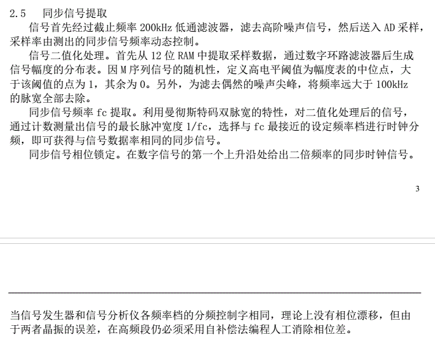
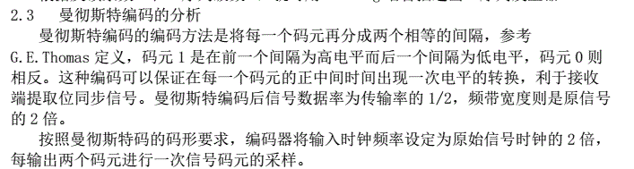

简易数字信号传输性能分析仪

## FPGA实现时钟恢复

- 经过低通滤波后的信号






## 仿真测试

### 假设

噪声信号为5V，经过衰减后的有用信号的大小为1V。

AD进来最大3.3V，过FIFO，DSP模块对其进行判断，设定为与其最近的频率档

数据的频率为10k-100kbps，噪声为10Mbps，测试最差的情况，100k/10M

### 时钟频率提取

- 计算最大脉宽$1/f_c$
- 寻找最近的测量点
- 生成分频后时钟
- 鉴相器判断超前滞后，相位同步
- 相位同步后，对采集进来的数据，每一个时钟进行平均，减少噪声。

### Mathmatica与C仿真

- 先实现最理想的情况，不考虑噪声带来的影响，数据生成部分
  - [ ] Mathematica造出10k - 100k 的经过Manchester编码后的m序列
    - 数据的m序列长度为255，取2550个数据，每10个数据为一个数字
    - 时钟的速率为每10个数据为一个周期，时钟一次上升下降
    - 那么相当于为时钟的数据为25500，
  - [ ] 计算最大脉宽，求出$f_c$
  - [ ] 生成分频后的时钟数据，储存为txt供Mathematica读取

- C算法验证部分

  - [x] 直接输入25500个数据，就算采样之后的数据

    - 遍历一遍，计算最长的脉冲宽度（时钟的周期与最长脉冲宽度一致）

      - 这里就特么遇到第一个问题，如何判断最短脉冲与最长脉冲，因为要做平均，先全部存下来period[25500]，然后跑一个循环，如果当前脉冲宽度大于最短脉冲宽度的两倍，则
        
    ```c++
    unsigned long int longperiod = period[0];
    unsigned long int shortperiod = period[0];
    	
    // Rough calculate period
    for (int i = 0; i < (k-1); i++) {
    	if (period[i] > shortperiod * 1.8)
    		longperiod = period[i];
    	else if ((shortperiod/2 <= period[i]*1.8) && (period[i]*1.8 <= longperiod)) {
    		longperiod = shortperiod;
    		shortperiod = period[i];
    	}
    }
    printf("longperiod is %d, shortperiod is %d\n", longperiod, shortperiod);
    ```
    
  - [ ] 确定时钟宽度，确定边沿
    
    - 这里也有nmd离谱的东西，就是，确定一个上升沿之后，如何确定它是在源时钟的上升沿和下降沿，这个就得判断这个时钟一个周期的时间内，曼彻斯特码是否有变化，讲道理单片机可以背景一个线程一直跑。


## 算了用FPGA了

- AD采样100M，滤波后信号数据速率10-100k，降采样时钟10M
  - 那么可能得到的最长脉冲宽度为[20, 200]，从20 - 200分十个档，（如果100M的话）最长脉冲
  - 选择最长的脉冲宽度，采样一段，然后不停更新完事了。

曼切斯特编码统一，规定0代表由0到1，1代表由1到0。


写入四个数（采样率，数据速率，点数，占空比误差）

1e7(10M), 1e4(10k, 10000, 0)

差1000倍，也就是每500个点一变化。

插入ILA核之后，看下输出有可能是文件没删干净，最坏打算换个工程，JTAG频率

单独一个AD的IP核是可以工作的

